# AssetWise — Detailed Implementation Plan (from BRD v1)

> **This is the original plan document, kept as written.** For what is actually built today see [MODULES_INDEX.md](MODULES_INDEX.md)'s status column and [`../decisions-log.md`](../decisions-log.md). Short version as of 2026-08-07: M00, M03, M04, M08 complete; M01 and M02 partial; M05 and M06 next; 273 tests passing.

## Context

- **Source:** [Asset_Management_BRD_v1.txt](c:\Users\KALPESH\Downloads\Asset_Management_BRD_v1.txt)
- **Workspace:** [g:\AssetWise](g:\AssetWise) is empty — full greenfield setup *(historical — the repo now lives on `daniels_branch`)*
- **Deployment model:** Single system, **no multi-tenancy** — but assets carry a `company_id` so ownership can be tracked per company and assets can be transferred between companies (inter-company transfer). Reports can be filtered and grouped by company.
- **Target hosting:** Shared hosting (PHP + MySQL, no long-running workers assumed unless cron is available)
- **Module plans (parallel dev):** [MODULES_INDEX.md](MODULES_INDEX.md) — 18 modules (M00–M17) with per-file specs in `modules/`

---

## Development Modules (Parallel Split)

| Dev 1 | Dev 2 |
|-------|-------|
| M00 → M01 → M02 → M03 → M04 ∥ M05 → M06 | M11 (after M03) ∥ M08 (after M01) → M09 + M17 Kits → M16 Depreciation → M10 Audit → M13 Disposal → M14 Reports → M15 PWA |
| M07 Shared UI (ongoing) | M12 Notifications (stub → complete) |

**Start order:** Install Laragon → M00 → M01 → then both tracks per [MODULES_INDEX.md](MODULES_INDEX.md).

---

## Recommended Tech Stack

| Layer | Choice | Rationale |
|-------|--------|-----------|
| Backend | **Laravel 13** | BRD-specified; mature auth, queues, exports, file storage |
| Database | **MySQL 8** | BRD-specified; JSON columns for dynamic field values |
| UI | **Blade + Alpine.js + Tailwind CSS** | BRD-specified; low JS complexity, shared-hosting friendly |
| Auth scaffold | **Laravel Breeze (Blade)** | Session auth, login history hooks, minimal overhead |
| RBAC | **Spatie Laravel Permission** | Roles + granular permissions map cleanly to BRD masters |
| Activity log | **Spatie Activity Log** | Before/after, user timeline, audit trail |
| QR/Barcode | **simplesoftwareio/simple-qrcode** + **picqer/php-barcode-generator** | Generation; mobile camera via PWA + `html5-qrcode` or similar |
| Excel/PDF | **Laravel Excel (Maatwebsite)** + **DomPDF or Snappy** | Bulk import/export and report exports |
| PWA | **vite-plugin-pwa** (Phase 3) | **Full website** installable as PWA; camera QR scan is a feature within it |
| File storage | **Laravel filesystem** (`storage/app/public`) | Photos, attachments, invoices — symlink on shared hosting |

**Shared hosting constraints to design for early:**
- Use **database queue driver** or **sync** initially; migrate to cron-driven `queue:work --stop-when-empty` if host allows
- Use **database cache** or file cache
- Schedule warranty/AMC/audit alerts via **Laravel Scheduler + single cron entry**
- Keep heavy exports as **queued jobs** with download links

---

## High-Level Architecture

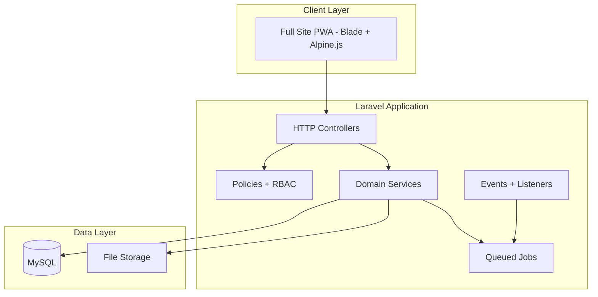

**Layering convention (apply across all modules):**
- `app/Models/*` — Eloquent models with relationships
- `app/Http/Controllers/*` — thin controllers
- `app/Services/*` — business logic (movement, audit, disposal, workflow)
- `app/Policies/*` — authorization per module
- `app/Http/Requests/*` — validation (including dynamic field rules)
- `resources/views/*` — Blade layouts, components, module screens
- `database/migrations/*` — schema
- `database/seeders/*` — default roles, permissions, statuses

---

## Expert Panel Review & Confirmed Decisions

Cross-functional review of the BRD against the initial schema surfaced gaps in **custom fields**, **category lifecycle**, and **transfer approval**. Decisions below are confirmed and drive the schema and flows in this plan.

| # | Expert | Question | Decision |
|---|--------|----------|----------|
| 1 | DB Architect | Custom field inheritance in category tree? | **Inherit with override** — child categories inherit parent fields; child can hide or override label/required on inherited fields |
| 2 | Data Modeler | Category change after asset has custom data? | **Block change** — locked once custom field values exist; only users with `assets.override_category` can force-change |
| 3 | Domain Expert | Asset Type vs Category? | **Independent** — category drives custom fields; type is a separate classification (Movable, Fixed, IT, FF&E, etc.) |
| 4 | QA / Audit | Field definition changes after data exists? | **Soft-delete only** — deactivated fields hidden on new assets; existing assets show values read-only |
| 5 | Operations | Bulk import with per-category fields? | **Per-category template** — downloadable Excel template matches that category's resolved field set |
| 6 | Workflow | Transfer approval? | **Always required** — every transfer goes through multi-level approval before taking effect |
| 7 | Operations | QR/Barcode lifecycle? | **Pre-generate tag pool** — print labels first, assign to assets later; replacement assigns new tag and deactivates old; **replacement requires approval** |
| 8 | Finance | Depreciation configuration? | **Category default + per-asset override** — method, useful life, salvage value |
| 9 | Finance | Depreciation methods in MVP? | **Straight-line only** — strategy-pattern architecture ready for more methods later |
| 10 | Operations | Kit / bundle assignment? | **Both** — saved kit templates AND ad-hoc multi-asset bundles |
| 11 | Workflow | Kit assignment approval? | **Configurable** — admin setting: one approval for whole kit OR per-asset approvals |

**Schema corrections from initial plan:**
- Replaced vague `asset_field_values` ("typed or JSON") with explicit **EAV typed columns** for searchability
- Added `category_field_overrides` for inherit-and-override behavior
- Added `category_field_options` for dropdown values (normalized, not only JSON blob)
- Pulled **approval workflow engine** into Phase 2 (needed for all transfers); disposal reuses same engine in Phase 3
- Clarified `asset_types` and `asset_categories` as orthogonal on `assets`
- Replaced per-asset auto-generated QR with **`tags` inventory pool** + assignment history; tag replacement is approval-gated (Phase 2)
- Added **depreciation** tables + calculator strategy pattern (straight-line MVP)
- Added **asset kits** (templates + ad-hoc bundles) with configurable approval mode

---

## Database Design Strategy

Design around a **stable asset core**, **category-scoped EAV custom fields with inheritance**, and **immutable history tables**.

### Entity relationship (custom fields focus)

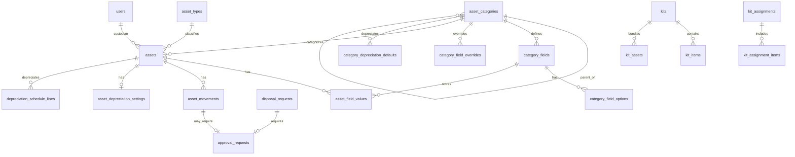

### Depreciation model (multi-method architecture, straight-line MVP)

**Configuration:** Category sets defaults; each asset may override. Calculator uses **strategy pattern** so additional methods plug in without schema changes.

#### `depreciation_methods` (master)
| Column | Notes |
|--------|-------|
| id | PK |
| code | `straight_line`, `declining_balance`, `double_declining_balance`, `sum_of_years_digits`, `units_of_production` |
| name | Display name |
| calculator_class | PHP class implementing `DepreciationCalculatorInterface` |
| is_active | Only `straight_line` active in MVP; others seeded inactive |

#### `category_depreciation_defaults`
| Column | Notes |
|--------|-------|
| category_id | FK |
| depreciation_method_id | FK |
| useful_life_months | int |
| salvage_value | decimal nullable |
| salvage_percent | decimal nullable (alternative to fixed salvage) |
| start_basis | enum: `purchase_date`, `commission_date` |

#### `asset_depreciation_settings` (per-asset, overrides category default)
| Column | Notes |
|--------|-------|
| asset_id | FK unique |
| depreciation_method_id | FK override |
| useful_life_months | override |
| salvage_value | override |
| start_date | depreciation start |
| purchase_cost_basis | decimal (from asset or override) |
| accumulated_depreciation | decimal cached |
| current_book_value | decimal cached |
| is_depreciation_active | boolean |

#### `depreciation_schedule_lines` (append-only schedule)
| Column | Notes |
|--------|-------|
| asset_id | FK |
| period_year, period_month | int |
| depreciation_amount | decimal |
| accumulated_depreciation | decimal |
| book_value | decimal |
| status | `scheduled`, `posted` |
| posted_at | timestamp nullable |

**Service:** `App\Services\Depreciation\DepreciationCalculatorInterface`  
Implementations: `StraightLineCalculator` (MVP), stubs for future methods.  
**Scheduler:** monthly job posts current period lines for active assets.

**Straight-line formula:** `(cost_basis - salvage_value) / useful_life_months` per period.

### Asset kits & bundles model

Supports **named kit templates** (e.g. "Developer Workstation") and **ad-hoc bundles** (pick assets at assignment time).

#### `kits` (template master)
| Column | Notes |
|--------|-------|
| id | PK |
| name, code | unique code |
| description | text |
| is_active | boolean |
| timestamps, soft_deletes | |

#### `kit_items` (template line — what belongs in the kit)
| Column | Notes |
|--------|-------|
| kit_id | FK |
| label | e.g. "Laptop", "Monitor" |
| asset_category_id | FK nullable — expected category for slot |
| quantity | int default 1 |
| sort_order | int |

#### `kit_assets` (actual assets linked to a kit instance)
| Column | Notes |
|--------|-------|
| kit_id | FK |
| asset_id | FK |
| kit_item_id | FK nullable — which template slot this fills |
| unique(kit_id, asset_id) | |

A kit is **ready to assign** when all required `kit_items` have matching `kit_assets` (or admin confirms partial kit).

#### `kit_assignments` (assignment / movement batch)
| Column | Notes |
|--------|-------|
| id | PK |
| kit_id | FK nullable — null = ad-hoc bundle |
| assignment_type | enum: `kit_template`, `ad_hoc_bundle` |
| movement_type_id | FK |
| to_custodian_id, to_location_id, etc. | target |
| status | draft, pending_approval, approved, rejected, completed |
| approval_mode | `single`, `per_asset` — snapshot of system setting at submit |
| approval_request_id | FK nullable — used when `single` |
| requested_by | FK users |

#### `kit_assignment_items`
| Column | Notes |
|--------|-------|
| kit_assignment_id | FK |
| asset_id | FK |
| asset_movement_id | FK nullable — created on approval (one per asset) |

**System setting** (`config/assetwise.php`): `kit_assignment_approval_mode` = `single` | `per_asset` (admin UI in M17).

**On approve (single):** one approval → create `asset_movements` for all items, apply atomically.  
**On approve (per_asset):** each asset has its own `approval_request` / movement chain.

### Custom fields data model (detailed)

**Resolution rule:** When rendering or validating an asset in category `C`, the effective field set =
1. All active `category_fields` defined on `C` and every ancestor category (walking up `parent_id`)
2. Minus fields hidden via `category_field_overrides` on `C`
3. With label/required overrides applied from `category_field_overrides` on `C`

#### `asset_categories`
| Column | Type | Notes |
|--------|------|-------|
| id | bigint PK | |
| parent_id | bigint FK nullable | Self-referential tree |
| name | varchar | Display name |
| code | varchar unique | Stable slug for imports/reports |
| description | text nullable | |
| is_active | boolean | |
| sort_order | int | |
| created_by, updated_by | FK users | |
| timestamps, soft_deletes | | |

#### `category_fields` (definitions — owned by one category)
| Column | Type | Notes |
|--------|------|-------|
| id | bigint PK | |
| category_id | bigint FK | Category where field is **defined** (may be ancestor) |
| field_key | varchar | Machine name, unique per defining category |
| label | varchar | Display label |
| field_type | enum | text, number, date, dropdown, boolean, textarea |
| is_required | boolean | Default required flag |
| validation_rules | json nullable | min, max, regex, decimal_places |
| display_order | int | |
| is_searchable | boolean | Index in list filters when true |
| is_active | boolean | Deactivate without delete |
| deleted_at | timestamp nullable | Soft-delete; existing values preserved read-only |
| timestamps | | |

#### `category_field_options` (dropdown values)
| Column | Type | Notes |
|--------|------|-------|
| id | bigint PK | |
| category_field_id | bigint FK | |
| option_value | varchar | Stored value |
| option_label | varchar | Display label |
| sort_order | int | |
| is_active | boolean | |

#### `category_field_overrides` (child overrides on inherited fields)
| Column | Type | Notes |
|--------|------|-------|
| id | bigint PK | |
| category_id | bigint FK | Child category applying override |
| category_field_id | bigint FK | Inherited field being overridden |
| override_type | enum | hide, relabel, change_required |
| override_label | varchar nullable | When relabel |
| is_required | boolean nullable | When change_required |
| timestamps | | |
| unique(category_id, category_field_id) | | |

#### `asset_field_values` (EAV — one row per asset per resolved field)
| Column | Type | Notes |
|--------|------|-------|
| id | bigint PK | |
| asset_id | bigint FK | |
| category_field_id | bigint FK | Links to definition (including soft-deleted) |
| value_text | varchar nullable | text, textarea, dropdown |
| value_number | decimal nullable | number |
| value_date | date nullable | date |
| value_boolean | boolean nullable | boolean |
| timestamps | | |
| unique(asset_id, category_field_id) | | |
| index(category_field_id, value_text) | | Searchable text fields |
| index(category_field_id, value_number) | | Searchable numbers |
| index(category_field_id, value_date) | | Searchable dates |

**Category change guard (application rule):** `AssetService::updateCategory()` rejects if `asset_field_values` count > 0 unless actor has `assets.override_category`. Admin force-change logs activity with before/after and does **not** auto-migrate values.

### Tag pool & assignment model (QR/Barcode)

Tags are **pre-generated into an inventory pool**, printed, then **assigned to assets** when ready. Replacement issues a new tag and retires the old one via **approval workflow** (Phase 2).

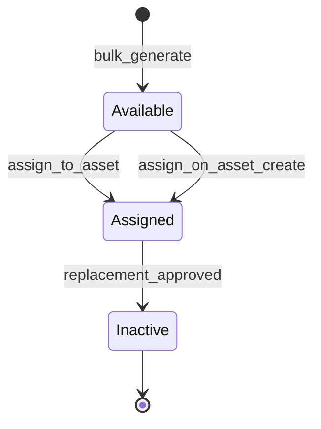

#### `tag_batches`
| Column | Notes |
|--------|-------|
| id | PK |
| quantity | Number generated |
| prefix | Optional tag number prefix |
| created_by | FK users |
| timestamps | |

#### `tags` (inventory — not tied to asset until assigned)
| Column | Notes |
|--------|-------|
| id | PK |
| tag_batch_id | FK nullable |
| tag_number | Unique human-readable code (also in QR/barcode) |
| qr_payload | Encoded URL e.g. `/scan/{tag_number}` |
| barcode_value | Unique scannable value |
| status | `available`, `assigned`, `inactive` |
| timestamps | |

#### `asset_tag_assignments` (assignment history)
| Column | Notes |
|--------|-------|
| id | PK |
| asset_id | FK |
| tag_id | FK |
| status | `active`, `inactive` |
| assigned_at, assigned_by | Initial or replacement assignment |
| deactivated_at, deactivated_by | Set when superseded |
| deactivation_reason | e.g. damaged label, re-tagging |
| timestamps | |
| unique partial | One `active` assignment per asset; one `active` assignment per tag |

#### `tag_replacement_requests` (Phase 2 — approval-gated)
| Column | Notes |
|--------|-------|
| id | PK |
| asset_id | FK |
| current_tag_id | FK tags — being replaced |
| new_tag_id | FK tags — must be `available` in pool |
| reason | Required text |
| status | draft, pending_approval, approved, rejected, completed |
| requested_by | FK users |
| approval_request_id | FK polymorphic link to M08 |
| timestamps | |

**Rules:**
- Asset may exist **without** a tag initially; tag assigned when label is physically applied
- **Initial assignment** from pool: direct (no approval) — select available tag or scan unassigned label
- **Replacement:** request → multi-level approval (M08 module `tag_replacement`) → on approve: old tag `inactive`, new tag `assigned`, old assignment `inactive`, new assignment `active`, sync `assets.asset_tag`
- Scan **inactive** tag: show retired message + link to current active tag/asset if permitted
- Scan **available** tag: offer to assign to asset (if permission)
- Never reuse a `tag_number` once generated

### Core tables (Phase 1 foundation)

| Table | Purpose |
|-------|---------|
| `users`, `roles`, `permissions` (+ Spatie pivots) | Auth & RBAC |
| `departments`, `branches`, `designations` | Org masters |
| `companies` | Company master — owns assets; enables inter-company transfers and company-level reporting |
| `asset_statuses`, `asset_types`, `locations`, `buildings`, `floors`, `rooms` | Shared masters |
| `priorities`, `movement_types`, `audit_types`, `disposal_types`, `maintenance_types` | Shared masters (movement_types includes Inter-Company Transfer) |
| `asset_categories` | Hierarchical classification; drives custom fields |
| `category_fields`, `category_field_options`, `category_field_overrides` | Dynamic field system |
| `assets` | Core record: `category_id` + `asset_type_id` (independent), tag, serial, location, custodian, financials |
| `asset_field_values` | Category custom field values (EAV) |
| `asset_photos`, `asset_attachments` | Media & documents |
| `tag_batches`, `tags`, `asset_tag_assignments`, `tag_replacement_requests` | Pre-generated tag pool, assign later, replacement history |
| `login_histories`, `device_logs`, `activity_log` | Security & audit trail |

#### `assets` (key columns)
| Column | Notes |
|--------|-------|
| asset_tag | Denormalized copy of active assigned `tags.tag_number` for search; synced on assignment |
| name, description, serial_number, model, manufacturer | Core identity |
| company_id | FK `companies` — **required**; tracks current owning company; updated atomically on inter-company transfer approval |
| category_id | FK — **locked** after custom field data exists |
| asset_type_id | FK — independent of category |
| status_id, location_id, building_id, floor_id, room_id | Current state |
| custodian_id, department_id, branch_id | Ownership |
| purchase_date, purchase_cost, vendor | Financial |
| warranty_expiry, amc_expiry | Quick-alert dates (detail in maintenance tables) |
| is_active | soft operational flag |
| created_by, updated_by | Audit |

### History, workflow & operations tables (Phase 2–3)

| Table | Purpose |
|-------|---------|
| `asset_movements` | Assignment, return, transfer, custodian change, **inter-company transfer**; status `draft/pending_approval/approved/rejected/completed`; `from_company_id`/`to_company_id` populated for inter-company type |
| `asset_status_histories` | Append-only status transitions |
| `approval_workflows`, `approval_steps` | Workflow definitions per module (transfer, disposal) |
| `approval_requests`, `approval_actions` | Polymorphic approvals with approve/reject/escalate log |
| `audit_campaigns`, `audit_items` | Physical/QR/manual verification |
| `maintenance_records`, `amc_contracts`, `warranty_records` | Maintenance lifecycle (supports multiple AMC/warranty records per asset) |
| `disposal_requests` | Disposal workflow |
| `notifications` | In-app alerts |
| `scan_logs` | QR/barcode scan events (includes inactive-tag scans) |
| `depreciation_methods`, `category_depreciation_defaults`, `asset_depreciation_settings`, `depreciation_schedule_lines` | Depreciation (M16) |
| `kits`, `kit_items`, `kit_assets`, `kit_assignments`, `kit_assignment_items` | Kits & bundles (M17) |
| `import_batches`, `import_batch_rows` | Bulk upload tracking + per-row errors |

**Design rules:**
- `tags.tag_number` is **globally unique** and indexed; `assets.asset_tag` mirrors active assignment
- Movement, status, and approval actions are **append-only** history
- `category_fields` use **soft-delete only**; never hard-delete if `asset_field_values` exist
- `assets`, `users`, `asset_categories` use soft deletes where referential integrity matters
- All mutable entities track `created_by`, `updated_by`

---

## Application Structure (proposed)

```
g:\AssetWise\
├── app/
│   ├── Http/Controllers/
│   │   ├── Admin/          # Masters, users, roles
│   │   ├── Assets/         # Asset CRUD, bulk, QR
│   │   ├── Movement/       # Phase 2
│   │   ├── Audit/          # Phase 2
│   │   ├── Maintenance/    # Phase 2
│   │   ├── Disposal/       # Phase 3
│   │   ├── Reports/        # Phase 3
│   │   └── Api/            # Minimal JSON for PWA scan endpoints
│   ├── Models/
│   ├── Services/
│   │   ├── AssetService.php
│   │   ├── DynamicFieldService.php
│   │   ├── QrBarcodeService.php
│   │   ├── MovementService.php
│   │   ├── AuditService.php
│   │   ├── MaintenanceService.php
│   │   ├── DisposalService.php
│   │   ├── WorkflowService.php
│   │   ├── ReportService.php
│   │   └── NotificationService.php
│   ├── Policies/
│   ├── Exports/            # Excel exports
│   └── Imports/            # Bulk upload
├── resources/views/
│   ├── layouts/            # app, guest, print (QR labels)
│   ├── components/         # tables, filters, dynamic-field renderer
│   └── modules/            # per-module views
├── routes/
│   ├── web.php
│   └── api.php             # scan + mobile helpers
└── database/migrations/
```

---

## RBAC & Permission Model

Seed permissions grouped by module (examples):

- `users.view`, `users.create`, `users.edit`, `users.delete`
- `masters.manage` or split per master entity
- `assets.view`, `assets.create`, `assets.edit`, `assets.delete`, `assets.bulk`, `assets.export`
- `movement.assign`, `movement.transfer`, `movement.verify`
- `audit.manage`, `audit.verify`
- `maintenance.manage`
- `disposal.request`, `disposal.approve`
- `reports.view`, `reports.export`
- `workflow.approve`

**Default roles (seeded):**
- **Super Admin** — all permissions
- **Asset Manager** — assets, movement, masters (read), reports
- **Department User** — view assigned assets, request movement
- **Auditor** — audit campaigns + verification
- **Approver** — workflow approval steps
- **Viewer** — read-only dashboards and registers

Gate all routes via middleware `permission:` or policies.

Additional permissions from expert decisions:
- `assets.override_category` — force category change when custom field data exists
- `category_fields.manage` — define/soft-delete custom fields and overrides
- `workflow.approve` — act on approval steps
- `imports.manage` — bulk upload per category

---

## User Flows (Complete)

All flows assume RBAC checks at each step. Denied users see 403 or hidden actions.

### UF-01: Authentication & Session

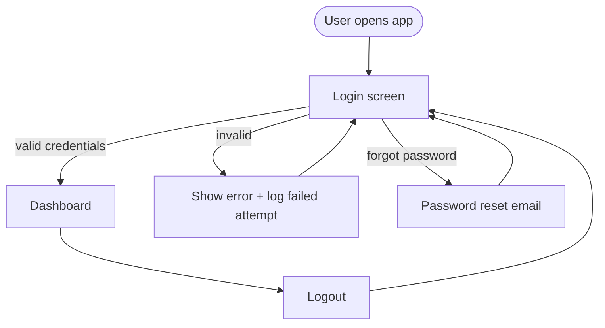

| Step | Actor | Action | System |
|------|-------|--------|--------|
| 1 | User | Enter email + password | Validate credentials |
| 2 | System | On success | Create session, log `login_histories` (IP, user agent, device) |
| 3 | User | Use app | Session timeout per config; optional admin force-logout |
| 4 | User | Logout | Destroy session, redirect to login |

### UF-02: User & Role Management (Admin)

| Step | Actor | Action | System |
|------|-------|--------|--------|
| 1 | Admin | Open Users list | Paginated list with search |
| 2 | Admin | Create user | Assign branch, department, designation, role(s), active flag |
| 3 | Admin | Manage roles | CRUD roles; assign permissions via matrix |
| 4 | Admin | Manage org masters | CRUD departments, branches, designations |
| 5 | System | On any change | Activity log entry (before/after) |

### UF-03: Shared Masters Management

| Step | Actor | Action | System |
|------|-------|--------|--------|
| 1 | Admin | Open master module | List with search/sort |
| 2 | Admin | Create/edit/deactivate | Validate uniqueness, referential integrity |
| 3 | Admin | Location hierarchy | Location → Building → Floor → Room cascading CRUD |
| 4 | System | Deactivate master in use | Block or warn based on foreign key usage |

### UF-04: Category & Custom Field Setup

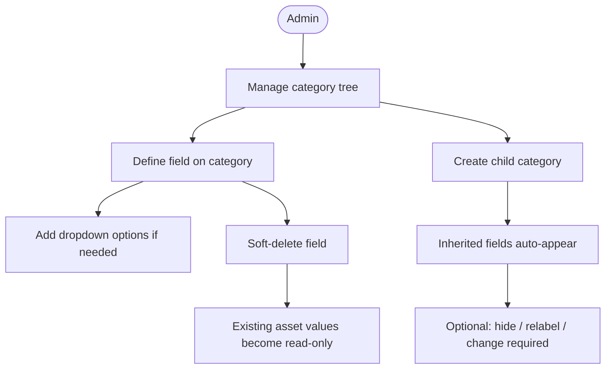

| Step | Actor | Action | System |
|------|-------|--------|--------|
| 1 | Admin | Build category tree | parent_id hierarchy with codes |
| 2 | Admin | Add field on parent category | Save to `category_fields` + options |
| 3 | Admin | Create child category | Child form resolves inherited fields |
| 4 | Admin | Override inherited field | Save `category_field_overrides` (hide/relabel/required) |
| 5 | Admin | Soft-delete field | Set `deleted_at`; hide on new assets; read-only on existing |
| 6 | System | Resolve effective fields | `DynamicFieldService::resolveForCategory($id)` walks tree + overrides |

### UF-05: Asset Registration (Single)

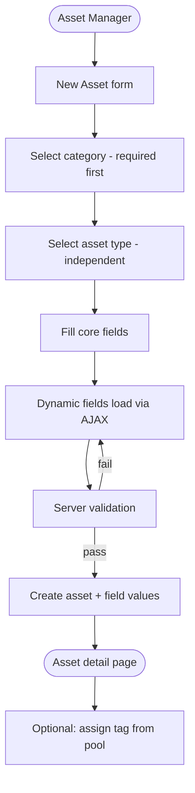

| Step | Actor | Action | System |
|------|-------|--------|--------|
| 1 | Asset Manager | Select **category** (first) | Load resolved custom fields + validation rules |
| 2 | Asset Manager | Select **asset type** | Independent dropdown (no form impact) |
| 3 | Asset Manager | Fill core fields | Tag, name, serial, location, custodian, financials |
| 4 | Asset Manager | Fill custom fields | Required fields enforced per resolved schema |
| 5 | Asset Manager | Upload photos/attachments | Store files; tag attachment type |
| 6 | System | On save | Insert `assets` + `asset_field_values`; activity log (no auto-tag) |
| 7 | Asset Manager | Assign tag (optional) | Pick available tag from pool or scan unassigned label → creates `asset_tag_assignments` |
| 8 | System | Category lock | Once field values exist, `category_id` is immutable for standard users |

### UF-06: Asset Edit & Category Lock

| Step | Actor | Action | System |
|------|-------|--------|--------|
| 1 | User | Open asset edit | Load core + custom fields (include soft-deleted field values read-only) |
| 2 | User | Attempt category change | **Blocked** if `asset_field_values` exist |
| 3 | Admin | Force category change | Requires `assets.override_category`; logs activity; does not migrate values |
| 4 | User | Update fields | Validate; update EAV rows; activity log with before/after |

### UF-07: Asset Search, Filter & Export

| Step | Actor | Action | System |
|------|-------|--------|--------|
| 1 | User | Open asset list | Server-side pagination |
| 2 | User | Search | Match tag, name, serial, custodian |
| 3 | User | Filter | Status, type, category, branch, location, date range |
| 4 | User | Filter by custom field | Join `asset_field_values` where `is_searchable = true` |
| 5 | User | Export filtered set | Excel download with core + resolved custom columns for each asset's category |

### UF-08: Bulk Upload (Per-Category Template)

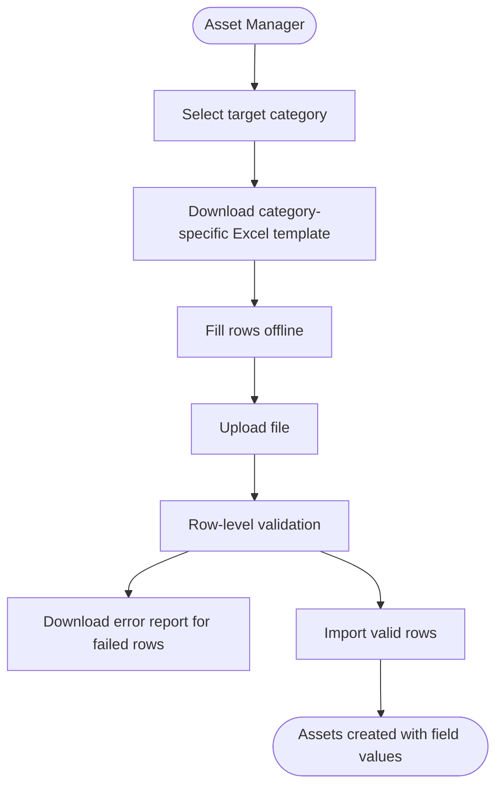

| Step | Actor | Action | System |
|------|-------|--------|--------|
| 1 | Asset Manager | Select category | System generates template: core columns + that category's resolved custom columns |
| 2 | Asset Manager | Download template | Static header row with field keys in row 2 (for mapping) |
| 3 | Asset Manager | Upload completed file | Parse rows; validate core + custom per resolved schema |
| 4 | System | On errors | Create `import_batches` + per-row errors; no partial silent failure |
| 5 | System | On success | Bulk insert assets + field values; tag assign optional per row if tag_number column provided |

### UF-09: Tag Pool — Generate, Print & Assign

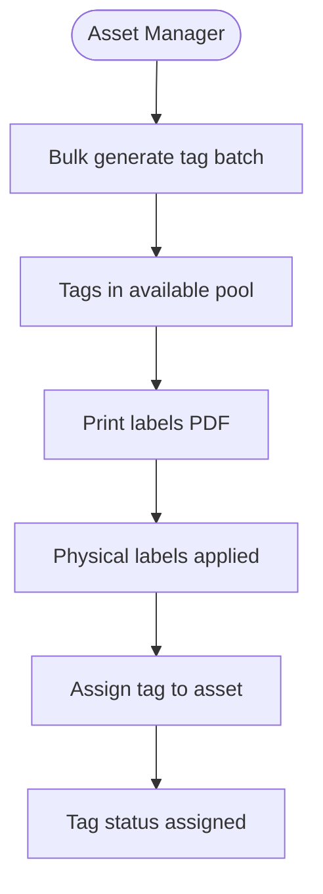

| Step | Actor | Action | System |
|------|-------|--------|--------|
| 1 | Asset Manager | Generate tag batch | Create N tags in `available` status with unique `tag_number`, QR payload, barcode |
| 2 | Asset Manager | Print labels | Bulk PDF from pool (all or selected available tags) |
| 3 | Asset Manager | Register asset | Asset saved without tag (tag optional at create) |
| 4 | Asset Manager | Assign tag to asset | Select from pool or scan unassigned label; create `asset_tag_assignments` active row; sync `assets.asset_tag` |
| 5 | Field User | Scan assigned tag | Resolve to asset; log `scan_logs` |

### UF-09b: Tag Replacement (Approval Required — Phase 2)

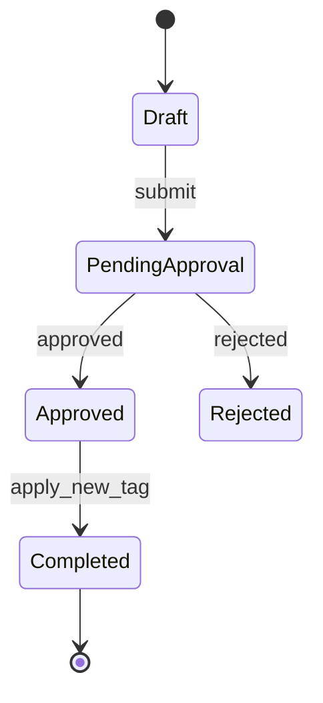

| Step | Actor | Action | System |
|------|-------|--------|--------|
| 1 | Asset Manager | Request tag replacement | Select asset, reason, pick **new available tag** from pool |
| 2 | Asset Manager | Submit | `tag_replacement_requests` → pending; spawn M08 approval (`tag_replacement`) |
| 3 | Approver(s) | Approve/reject | Multi-level per workflow config |
| 4 | System | On approve | Old tag → `inactive`; old assignment → `inactive`; new tag → `assigned`; new assignment → `active`; update `assets.asset_tag` |
| 5 | Field User | Scan old inactive tag | Show "Label retired" + current asset/tag link; log scan |
| 6 | Field User | Scan new tag | Resolves to asset normally |

### UF-10: Asset Movement (All Types — Approval Required)

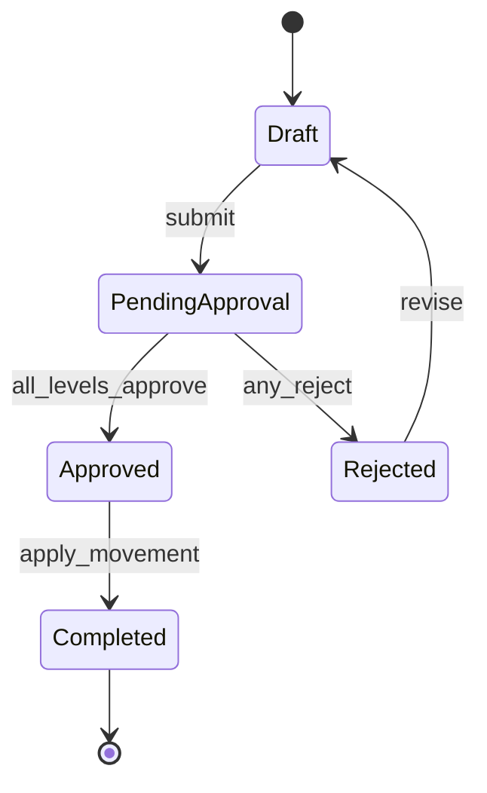

| Step | Actor | Action | System |
|------|-------|--------|--------|
| 1 | Asset Manager | Initiate movement | Select type: Assign, Return, Transfer, **Inter-Company Transfer**, Custodian Change |
| 2 | Asset Manager | Select asset(s) | Validate current status/custodian/location |
| 3 | Asset Manager | Enter from/to details | Location, custodian, department, notes; **for Inter-Company Transfer: select destination company** |
| 4 | Asset Manager | Submit | Create `asset_movements` status `pending_approval`; spawn `approval_request` |
| 5 | Approver(s) | Review queue | Multi-level approve/reject with comments |
| 6 | System | On full approval | Update asset location/custodian/status; **if inter-company transfer: update `assets.company_id` to destination company**; append `asset_status_histories`; notify custodian |
| 7 | System | On reject | Movement stays rejected; asset unchanged; notify requester |
| 8 | Auditor | Verify completed movement | Mark verified with timestamp (optional post-completion) |

**Note:** All movement types (including inter-company transfer) require the full approval pipeline.

### UF-11: Audit Campaign & Verification

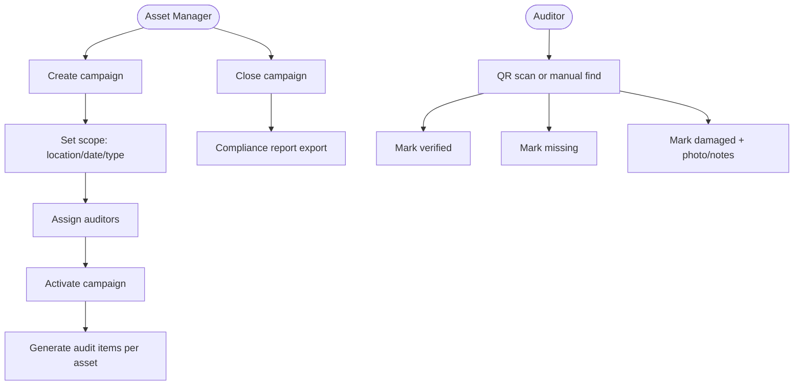

| Step | Actor | Action | System |
|------|-------|--------|--------|
| 1 | Asset Manager | Create campaign | Draft with scope filters |
| 2 | Asset Manager | Activate | Generate `audit_items`; notify auditors |
| 3 | Auditor | Verify asset | QR scan or manual; set status verified/missing/damaged |
| 4 | Auditor | Add evidence | Notes + optional photo for exceptions |
| 5 | Asset Manager | Monitor progress | Dashboard: % complete, exception list |
| 6 | Asset Manager | Close campaign | Lock items; export compliance report |
| 7 | System | On activate/close | Email + in-app audit alerts |

### UF-12: Maintenance, AMC & Warranty

| Step | Actor | Action | System |
|------|-------|--------|--------|
| 1 | Asset Manager | Log maintenance | Preventive or corrective; vendor, cost, dates, attachments |
| 2 | Asset Manager | Add AMC contract | Start/end, vendor, coverage; link to asset |
| 3 | Asset Manager | Record warranty | `warranty_records` (supports multiple); sync alert date on asset |
| 4 | System | Daily scheduler | Check warranty/AMC expiry at 30/7/1 days; send alerts |
| 5 | User | View asset detail | Service history timeline + cost rollup |
| 6 | Asset Manager | Set end-of-life | Flag + projected EOL date; include in aging reports |

### UF-13: Disposal & Scrap (with Approval)

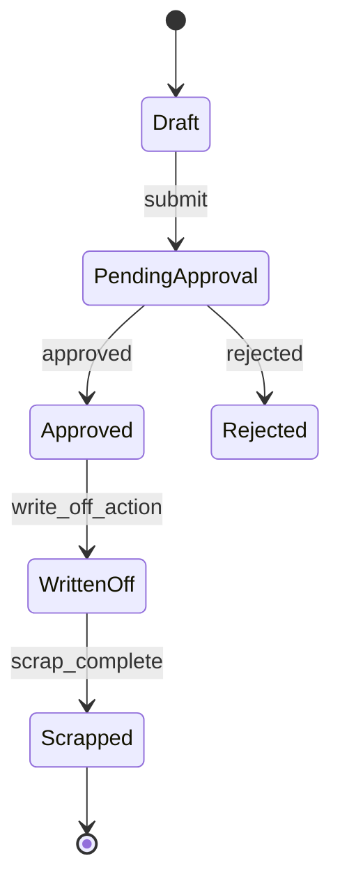

| Step | Actor | Action | System |
|------|-------|--------|--------|
| 1 | Asset Manager | Create disposal request | Asset, disposal type, reason, attachments |
| 2 | Asset Manager | Submit | `approval_request` via disposal workflow |
| 3 | Approver(s) | Approve/reject | Multi-level with escalation on timeout |
| 4 | Asset Manager | Write off | On approval; financial write-off recorded |
| 5 | Asset Manager | Complete scrap | Final state; asset status → Disposed |
| 6 | System | On disposed | Lock asset against new movements; activity log |

### UF-14: Approval Workflow (Transfer & Disposal)

| Step | Actor | Action | System |
|------|-------|--------|--------|
| 1 | Admin | Configure workflow | Define steps: level, approver role/user, escalation hours |
| 2 | Requester | Submit movement/disposal | Attach to workflow by module type |
| 3 | Approver | Act on pending item | Approve or reject with comment |
| 4 | System | Escalation job | If step overdue, escalate per matrix; notify next level |
| 5 | System | On final approval | Execute domain action (movement or disposal) |
| 6 | All | View history | `approval_actions` append-only log per request |

### UF-15: Reports & Dashboard

| Step | Actor | Action | System |
|------|-------|--------|--------|
| 1 | User | Open dashboard | KPIs: totals, by status/category/branch, alerts |
| 2 | User | Open report | Select type + filters |
| 3 | User | Preview on screen | Paginated results |
| 4 | User | Export Excel/PDF | Queue job if large; notify when ready |
| 5 | User | Download | Asset register includes core + custom fields per category |

### UF-16: Notifications

| Step | Actor | Action | System |
|------|-------|--------|--------|
| 1 | System | Event occurs | Assignment, approval needed, audit assigned, warranty/AMC expiry |
| 2 | System | Deliver | In-app `notifications` + email (if configured) |
| 3 | User | View bell icon | Mark read/unread |
| 4 | User | Click notification | Deep-link to relevant record |

### UF-17: Activity Log & User Timeline

| Step | Actor | Action | System |
|------|-------|--------|--------|
| 1 | System | On CRUD / status change | Spatie activity log with before/after properties |
| 2 | Admin | View global activity | Filter by user, module, date |
| 3 | Admin | View user timeline | All actions by a specific user |
| 4 | User | View asset timeline | Movements, status, maintenance, disposal on asset detail |

### UF-18: PWA Install & Mobile Use

| Step | Actor | Action | System |
|------|-------|--------|--------|
| 1 | User | Visit site on mobile (HTTPS) | Responsive layout |
| 2 | User | Accept install prompt | Add full app to home screen |
| 3 | User | Open installed app | Standalone window; same auth session |
| 4 | Field User | Use camera scan in audit/movement | `html5-qrcode`; fallback to manual tag entry |
| 5 | User | Lose connectivity | Offline fallback page; no data writes |

### UF-19: Depreciation Setup & Schedule

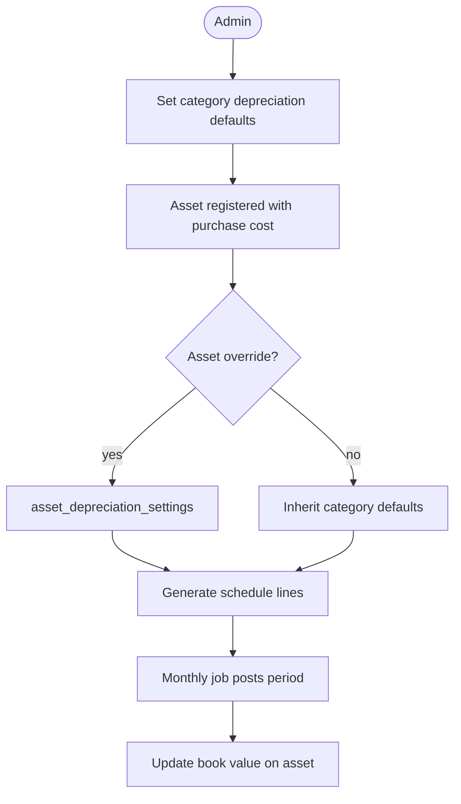

| Step | Actor | Action | System |
|------|-------|--------|--------|
| 1 | Admin | Configure category defaults | Method, useful life, salvage, start basis |
| 2 | System | On asset save | Resolve settings (category or override); generate `depreciation_schedule_lines` |
| 3 | Asset Manager | Override per asset | Optional different method/life/salvage (MVP: straight-line only selectable) |
| 4 | System | Monthly scheduler | Post current period; update accumulated + book value |
| 5 | User | View asset detail | Depreciation tab: schedule, book value, accumulated |
| 6 | User | Run depreciation report | M14 — by category, department, period |

### UF-20: Kit Template & Bundle Assignment

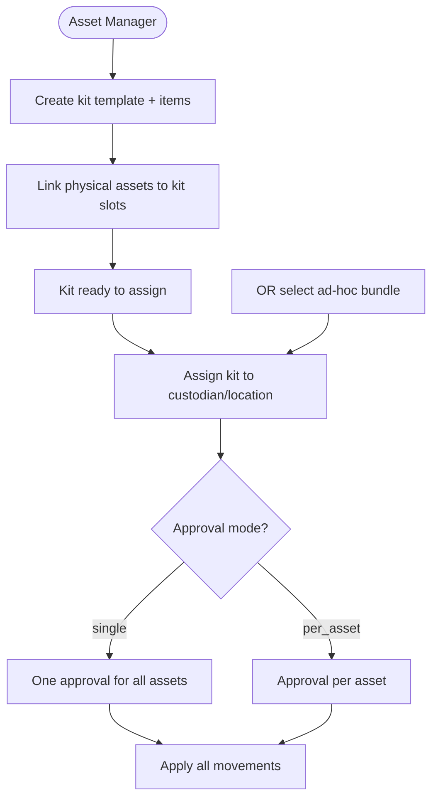

| Step | Actor | Action | System |
|------|-------|--------|--------|
| 1 | Asset Manager | Create kit template | Name, code, item lines (label, category, qty) |
| 2 | Asset Manager | Link assets to kit | Map real assets to template slots; validate category match |
| 3 | Asset Manager | Assign kit | Select movement type, to custodian/location; all kit assets move together |
| 4 | Asset Manager | Ad-hoc bundle | Select multiple assets without saved kit; same assignment flow |
| 5 | System | Submit | Apply `kit_assignment_approval_mode` from settings (`single` or `per_asset`) |
| 6 | Approver(s) | Approve | Single or per-asset per config |
| 7 | System | On complete | Create `asset_movements` for each item; update custodian/location; notify |

---

## Phase 1 — Foundation (MVP Core)

**Goal:** Authenticated users can manage org structure, masters, assets with custom fields, photos, attachments, and QR/barcodes.

### 1.1 Project bootstrap
- `composer create-project laravel/laravel .` in [g:\AssetWise](g:\AssetWise)
- Install Breeze (Blade), Tailwind, Alpine (included with Breeze)
- Install Spatie Permission + Activity Log
- Configure `.env` for MySQL, mail, filesystem
- Base layout: sidebar nav grouped by module, flash messages, permission-aware menu

### 1.2 User & Access Management (Developer 1)
**Screens:**
- Login / logout / password reset
- User CRUD (name, email, department, branch, designation, role, active flag)
- Role CRUD + permission assignment matrix
- Department, Branch, Designation masters
- Login history list (IP, user agent, timestamp, success/fail)
- Session listing + force logout (optional Phase 1 stretch)

**Implementation notes:**
- `LoginHistory` model + listener on `Login` / `Failed` events
- Device info from `User-Agent` parser (optional lightweight)
- Activity log on user/role changes

### 1.3 Shared Masters (Developer 1)
**CRUD for:**
- Asset Statuses (e.g., Available, Assigned, In Maintenance, Disposed)
- Asset Types
- Locations → Buildings → Floors → Rooms (cascading selectors in UI)
- Priorities, Movement Types, Audit Types, Disposal Types, Maintenance Types (seed defaults; full UI now, used later)

**UI pattern:** Reusable master CRUD component (Alpine-powered datatable: search, sort, pagination)

### 1.4 Asset Master (Developer 1)
**Features:**
- Asset registration form (core fields + category selector)
- Category hierarchy CRUD
- Asset list with search (tag, name, serial, custodian, location) and filters (status, type, category, branch, date range)
- Asset detail page (summary, photos, attachments, tag, custom fields, activity timeline)
- Bulk upload (Excel template with core columns + dynamic columns per category or separate metadata sheet)
- Bulk download (filtered export)
- Photo upload (multiple, primary flag)
- Attachment upload with type (invoice, warranty, manual, agreement)

**Core asset fields:**
- `asset_tag` (synced from active tag assignment; optional at create), `name`, `description`, `serial_number`, `model`, `manufacturer`
- `category_id`, `asset_type_id`, `status_id`
- `location_id`, `building_id`, `floor_id`, `room_id`
- `custodian_id` (user), `department_id`, `branch_id`
- `purchase_date`, `purchase_cost`, `vendor`, `warranty_expiry`, `amc_expiry`
- `notes`, `is_active`

### 1.5 Dynamic Fields & Metadata (Developer 1)
**Admin — Category Field Builder:**
- Define fields on any category node in the tree
- Field types: text, number, date, dropdown, boolean, textarea
- Dropdown options via `category_field_options` table
- Inherited fields visible on child categories; child admin can **hide / relabel / change required** via overrides UI
- Soft-delete only: deactivated fields hidden on new assets; existing values shown read-only
- `DynamicFieldService::resolveForCategory()` — walks ancestors, merges overrides, caches per request

**Runtime — Asset Forms:**
- Category selected first → AJAX loads resolved field set
- Server-side validation from resolved schema (required, type, rules)
- Persist to `asset_field_values` EAV columns (`value_text`, `value_number`, `value_date`, `value_boolean`)
- **Category lock:** reject `category_id` change when field values exist (unless `assets.override_category`)
- Search/list: filter on fields where `is_searchable = true`

**Bulk import (per-category template):**
- `CategoryTemplateExport` generates Excel with core + resolved custom columns for selected category
- `CategoryTemplateImport` validates each row against same resolved schema
- Error report downloadable per batch

### 1.6 QR / Barcode — Tag Pool (Developer 1)
**Phase 1:**
- Tag batch generator: bulk create N tags into `available` pool
- QR + barcode images per tag (not per asset)
- Print labels from pool (bulk PDF via DomPDF)
- Assign available tag to asset (dropdown or scan unassigned label)
- Asset create does **not** auto-generate tags
- Scan route `/scan/{tag_number}` — resolves by tag status (assigned → asset, available → assign UI, inactive → retired message)
- `scan_logs` for all scan types
- Tag history tab on asset detail (all past assignments)

**Phase 2 (with M08):**
- Tag replacement request UI + approval workflow module `tag_replacement`
- On approval: swap tags per UF-09b rules

### 1.7 Shared Services (Developer 1)
Build early to unblock Developer 2:
- `NotificationService` (stub mail + DB notifications)
- `ReportService` (skeleton)
- `WorkflowService` (stub interface for Phase 3)
- Reusable Blade components: `x-data-table`, `x-filter-bar`, `x-master-form`, `x-dynamic-fields`, `x-attachment-uploader`

### Phase 1 deliverables checklist
- [ ] Deployable Laravel app with auth + RBAC
- [ ] All Phase 1 masters manageable
- [ ] Full asset CRUD with photos, attachments, custom fields
- [ ] Bulk import/export working with validation errors report
- [ ] Tag pool generate + print + assign to asset + scan (replacement in Phase 2)
- [ ] Activity log on all create/update/delete
- [ ] Seeders for demo data

---

## Phase 2 — Operations

**Goal:** Approval-gated asset movement, audits, and maintenance with full history.

### 2.0 Approval Workflow Engine (Developer 2) — pulled forward from Phase 3

Required before movements ship (all transfers need approval).

**Build:**
- `approval_workflows` + `approval_steps` (module: `transfer`, `disposal`)
- `approval_requests` (polymorphic) + `approval_actions` (append-only)
- `WorkflowService::submit()`, `approve()`, `reject()`, `escalate()`
- Approver inbox UI + email/in-app notification on pending step
- Escalation via daily scheduler job
- Seed default transfer workflow (e.g., Department Head → Asset Manager)
- Seed default tag replacement workflow (e.g., Asset Manager → Admin)
- Support workflow module enum: `transfer`, `disposal`, `tag_replacement`

### 2.1 Asset Movement (Developer 2)
**Transaction types:** Assignment, Return, Transfer, Custodian Change — **all require approval**

**Flow per movement:**
1. Select asset(s) — validate current status/custodian; block if disposed or pending movement
2. Capture movement type, from/to location, from/to custodian, department, notes
3. Create `asset_movements` row with status `pending_approval`
4. Submit `approval_request` linked to movement
5. On full approval → update `assets` location/custodian/status; set movement `completed`
6. Append `asset_status_histories`; notify custodian (email + in-app)
7. On reject → movement `rejected`; asset unchanged; notify requester
8. Activity log on submit, approve, reject, complete

**Screens:**
- New movement wizard (single + bulk) with submit-for-approval
- Approver pending queue
- Movement history (per asset + global) with approval status
- Status history timeline on asset detail
- Post-completion verification screen (mark verified with user + timestamp)

### 2.2 Audit & Verification (Developer 2)
- **Audit campaigns:** name, type, date range, location scope, assigned auditors, status (draft/active/closed)
- **Audit items:** one per asset in scope; states: pending, verified, missing, damaged
- Verification methods: QR scan (links to asset), manual confirm, notes + photo
- Missing/damaged asset tracking with resolution workflow
- Campaign progress dashboard (% verified, exceptions)
- Compliance report export (Excel/PDF)

### 2.3 Maintenance (Developer 2)
- **Maintenance records:** type (preventive/corrective), dates, vendor, cost, description, status, linked attachments
- **AMC tracking:** contract start/end, vendor, coverage, renewal alerts
- **Warranty tracking:** linked to asset `warranty_expiry` with history
- **Service history:** timeline on asset detail
- **Repair cost rollup** per asset
- **End of life:** flag + projected EOL date field; alert when approaching

**Scheduled jobs (cron):**
- Daily check for warranty/AMC expiring in 30/7/1 days → email + in-app notification

### 2.4 Depreciation (Developer 2) — Module M16
- Seed `depreciation_methods` (straight-line active; others inactive stubs)
- Category depreciation defaults admin UI
- Per-asset override on asset financial tab
- `StraightLineCalculator` + `DepreciationService::generateSchedule()`, `postPeriod()`
- Monthly scheduler job; depreciation tab on asset detail

### 2.5 Asset Kits & Bundles (Developer 2) — Module M17
- Kit template CRUD + item lines + link assets to slots
- Kit assignment wizard (template or ad-hoc bundle)
- Admin setting: `kit_assignment_approval_mode` (single vs per_asset)
- Integrate with M08/M09 movement + approval flows

### Phase 2 deliverables checklist
- [ ] Approval workflow engine with escalation
- [ ] All movement types approval-gated with immutable history
- [ ] Kit templates + ad-hoc bundle assignment with configurable approval
- [ ] Straight-line depreciation with category defaults and asset overrides
- [ ] Audit campaign lifecycle end-to-end
- [ ] Maintenance + AMC + warranty with alerts
- [ ] Notifications wired for movement, approval, and expiry

---

## Phase 3 — Governance, Insights, Mobile

**Goal:** Disposal with approvals, reporting dashboards, workflow engine, and PWA.

### 3.1 Disposal & Scrap (Developer 2)
- Disposal request: asset, type, reason, requested by, attachments
- Approval chain (uses workflow engine)
- States: draft → pending approval → approved → written off → scrapped
- On final approval: set asset status to Disposed, lock further movements
- Disposal history report

### 3.2 Approval Workflow — Disposal Integration (Developer 2)

Workflow engine built in Phase 2.0. Phase 3 extends it for disposal:

- Add `disposal` module workflow configuration
- Reuse `approval_requests` polymorphic link to `disposal_requests`
- Escalation matrix shared with transfer workflows
- Admin UI to manage workflow steps per module without code changes

### 3.3 Reports & Dashboards (Developer 2)
**Dashboard KPIs:**
- Total assets, by status, by category, by branch
- Assets in maintenance, pending audits, expiring warranties/AMCs
- Recent movements, disposal pipeline

**Reports (filterable + export):**
- Asset Register
- Movement Report
- Audit Report
- Maintenance Report
- Disposal Report
- Asset Aging (by purchase date / useful life)
- Depreciation Schedule Report (period, accumulated, book value by asset/category)
- Utilization (assigned vs available)
- Kit assignment history report

Use queued exports for large datasets; download link when ready.

### 3.4 PWA Support — Full Website (Developer 2 + shared)

**Decision:** The entire AssetWise web application is the PWA, not a separate scan-only mini-app. This matches the BRD goals of mobile-responsive UI, installable application, and camera-based QR scanning as integrated capabilities.

**What gets installed:** Users install the full authenticated app (dashboard, assets, movement, audit, maintenance, reports) to their home screen — same routes and RBAC as the browser version.

**Implementation:**
- `vite-plugin-pwa` with a single `manifest.json` covering the whole app (`start_url: /dashboard`, `display: standalone`, app name/icons)
- Service worker caches **static assets** (CSS, JS, fonts, icons) for faster load; **not** a full offline data replica
- Network-first strategy for all Laravel Blade pages and API calls (data always fresh when online)
- Offline fallback page when connectivity is lost (friendly message + retry; no silent stale writes)
- Mobile-responsive layouts across all modules (not limited to scan screens)
- Camera-based QR scanning (`html5-qrcode` via Alpine) available within audit verification and asset lookup flows
- Install prompt banner on supported browsers (Chrome, Edge, Safari iOS 16.4+)
- `theme-color` and splash screens for native app feel

**What is NOT offline-capable (by design):**
- Creating/editing assets, movements, audits, approvals (require server validation)
- Bulk import/export and report generation
- Real-time notifications

**HTTPS required** on production for service worker registration and camera access.

### 3.5 Notifications (complete)
- Email templates for: assignment, audit assigned, warranty/AMC expiry, disposal status, approval required
- In-app notification bell with read/unread state
- User notification preferences (optional stretch)

### Phase 3 deliverables checklist
- [ ] Disposal workflow end-to-end
- [ ] Reusable approval engine
- [ ] Dashboard + all reports with Excel/PDF export
- [ ] Full-site PWA installable (all modules); camera QR scan works inside installed app

---

## Developer Work Split (per BRD)

| Developer | Modules |
|-----------|---------|
| **Developer 1** | User & Access, Shared Masters, Asset Master, Dynamic Fields, QR/Barcode, shared Blade components/services |
| **Developer 2** | Approval Workflow (Phase 2), Asset Movement, Audit, Maintenance, Disposal, Reports, PWA |
| **QA** | Test cases per phase, API tests for scan/movement endpoints, regression after each phase, UAT scripts |

**Integration points (coordinate early):**
- `DynamicFieldService::resolveForCategory()` API stable before bulk import and reports (Developer 1)
- Asset model must expose `hasCustomFieldData()` for category lock (Developer 1)
- `WorkflowService` interface stubbed Phase 1; full engine Phase 2.0 before movements (Developer 2)
- Permission names including `assets.override_category`, `workflow.approve` seeded Phase 1
- Per-category Excel template column order agreed between import/export classes

---

## UI / UX Standards

- **Layout:** Fixed sidebar, top bar with user menu + notifications
- **Lists:** Server-side pagination, column sort, persistent filters (query string)
- **Forms:** Blade components + Alpine for dynamic sections (cascading location, dynamic fields)
- **Feedback:** Toast/flash for success; inline validation errors
- **Print:** Dedicated print CSS for QR labels and reports
- **Accessibility:** Labels on all inputs, keyboard-navigable tables

---

## Testing Strategy (QA)

| Phase | Focus |
|-------|-------|
| Phase 1 | Auth, RBAC denial tests, master CRUD, asset CRUD, dynamic field validation, bulk import error handling, QR generation |
| Phase 2 | Movement state transitions, audit exception flows, maintenance date alerts |
| Phase 3 | Approval chains, escalation, disposal lock, export jobs, full-site PWA install + scan smoke tests |

**Automation:**
- PHPUnit feature tests per module (permission gates + happy path)
- Browser tests (Laravel Dusk) for critical flows: login, create asset, scan QR — optional if CI available

---

## Deployment Plan (Shared Hosting)

1. PHP 8.3+ (Laravel 13 requirement), required extensions (mbstring, openssl, pdo_mysql, gd/intl for QR)
2. Point web root to `/public`
3. `php artisan migrate --force` + `db:seed`
4. `php artisan storage:link`
5. Cron: `* * * * * php /path/to/artisan schedule:run`
6. Set `QUEUE_CONNECTION=database` and include `queue:work --stop-when-empty` in cron if supported
7. Mail via SMTP credentials on host
8. `.env` production: `APP_DEBUG=false`, secure `APP_KEY`

---

## Suggested Implementation Order (sprints)

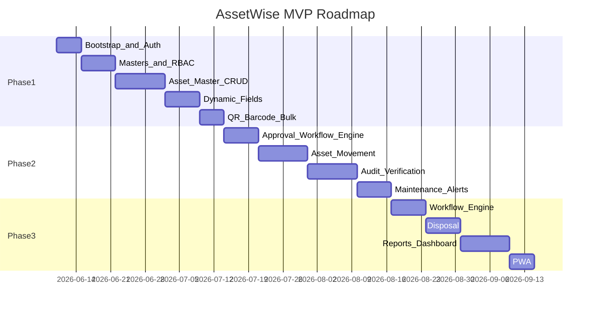

*Adjust durations to team velocity; Phase 1 is the critical path.*

---

## Risks & Mitigations

| Risk | Mitigation |
|------|------------|
| Dynamic fields + inheritance | EAV typed columns; `resolveForCategory()` with override table; cache resolved schema per category |
| Category change with data | Block by default; admin override permission; no silent value migration |
| Transfer approval latency | Approver inbox + email alerts; escalation job; bulk movement creates one approval per batch or per asset (TBD: default per batch) |
| Bulk upload errors | Row-level validation report downloadable; no partial silent failures |
| Shared hosting queue limits | Database queue + cron; sync fallback for small exports |
| Workflow scope creep | Generic engine Phase 2; only transfer + disposal modules in v1 |
| PWA camera permissions | HTTPS required; graceful fallback to manual tag entry |

---

## Out of Scope (per BRD)

- Full multi-tenancy / data isolation per company (companies share one DB schema; `company_id` tracks ownership only)
- Native mobile apps (PWA only)
- Advanced BI / external analytics warehouses
