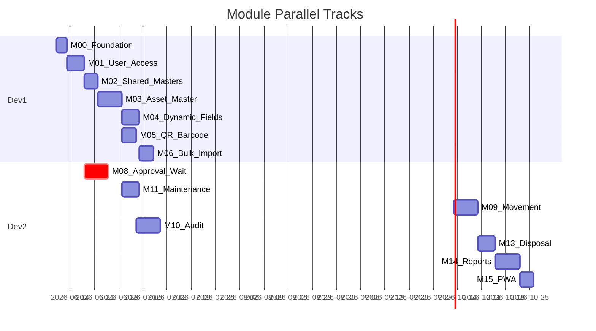

# AssetWise — Module Index (Parallel Development)

**Parent plan:** [MASTER_PLAN.md](MASTER_PLAN.md)  
**BRD source:** [Asset_Management_BRD_v1.txt](Asset_Management_BRD_v1.txt)

This index splits the BRD into **18 independent modules (M00–M17)** so Developer 1 and Developer 2 can work in parallel after shared foundation.

> **Current status:** M00, M03, M04 and M08 are complete on `daniels_branch` (273 tests passing). M01 and M02 are **partially** complete — enough for downstream modules to build on, but each has a real gap (see below). **M05 and M06 are next** — both unblocked, and they can run in parallel.
>
> **Known gaps to close (carried debt, not blockers):**
> - **M01** — no user or role administration UI at all (`/admin/users`, `/admin/roles` don't exist). Users and role assignments can only be created via seeder or `tinker`. Also missing: departments/branches/designations org-master CRUD.
> - **M02** — `CompanyController::toggleActive()` still has a placeholder comment where the "cannot deactivate a company that owns assets" check belongs. The `assets` table has existed since M03.

---

## Local Setup (Laragon on Windows)

Install and verify **before** Module M00.

### 1. Install Laragon

- Download [Laragon Full](https://laragon.org/download/) (includes PHP, MySQL, Apache/Nginx, Composer, Node)
- Install to default path (e.g. `C:\laragon`)
- Start Laragon → **Start All**

### 2. Version requirements

| Tool | Version |
|------|---------|
| PHP | **8.3+** — required, not a preference (Laravel 13; Composer's platform check aborts on 8.2) |
| MySQL | **8.0+** |
| Composer | **2.x** |
| Node.js | **20 LTS** or **22 LTS** |
| npm | **10+** (bundled with Node) |
| Git | Latest |

In Laragon: **Menu → PHP → Version** → select 8.3 or newer. Verify with `php -v` before reporting that artisan is broken — an 8.2 binary on the PATH fails every command with *"Composer detected issues in your platform"*.

### 3. Enable PHP extensions

Laragon usually enables these; confirm in `php.ini`:

- `mbstring`, `openssl`, `pdo_mysql`, `tokenizer`, `xml`, `ctype`, `json`, `bcmath`, `fileinfo`
- `gd` (QR/images), `intl`, `zip`, `exif` (photos)

Restart Apache after changes.

### 4. Create database

Laragon → **Database** → create database:

```sql
CREATE DATABASE assetwise CHARACTER SET utf8mb4 COLLATE utf8mb4_unicode_ci;
```

Or use HeidiSQL (bundled with Laragon).

### 5. Project location

Option A (recommended): develop in workspace `G:\AssetWise`  
Option B: `C:\laragon\www\AssetWise` and open that folder in Cursor

After M00, site URL will be: `http://assetwise.test` (if using Laragon auto virtual host) or `http://localhost/AssetWise/public`

### 6. Verify install (run in terminal)

```powershell
php -v
composer -V
node -v
npm -v
mysql --version
```

### 7. Optional but useful

- **Cursor** (already using)
- **Git** for version control
- **Mailpit** or Laragon mail catcher for testing emails (optional in Phase 1)
- **DB client:** HeidiSQL (Laragon) or TablePlus

### 8. What you do NOT need locally

- Redis (use `database` or `file` cache/queue)
- Docker (unless you prefer it over Laragon)
- Separate Apache/MySQL installs (Laragon includes them)

---

## Module Map

| ID | Module | Status | Dev | Phase | Depends On | Can Parallel With |
|----|--------|--------|-----|-------|------------|-------------------|
| [M00](modules/M00-foundation.md) | Project Foundation | ✅ done | Dev 1 | 1 | — | — (blocking start) |
| [M01](modules/M01-user-access.md) | User & Access | 🟡 partial | Dev 1 | 1 | M00 | — |
| [M02](modules/M02-shared-masters.md) | Shared Masters | 🟡 partial | Dev 1 | 1 | M00, M01 | M08 (after M01) |
| [M03](modules/M03-asset-master.md) | Asset Master Core | ✅ done | Dev 1 | 1 | M01, M02 | M08, M11 |
| [M04](modules/M04-dynamic-fields.md) | Dynamic Fields | ✅ done | Dev 1 | 1 | M03 | M05, M11 |
| [M05](modules/M05-qr-barcode.md) | QR / Barcode | 🔄 **next** | Dev 1 | 1 | M03 ✅ | M04, M11 |
| [M06](modules/M06-bulk-import-export.md) | Bulk Import / Export | 🔄 **next** | Dev 1 | 1 | M03 ✅, M04 ✅ | M08 |
| [M07](modules/M07-shared-ui-services.md) | Shared UI & Services | ⏳ pending | Dev 1 | 1 | M00 | All modules (ongoing) |
| [M08](modules/M08-approval-workflow.md) | Approval Workflow | ✅ done | Dev 2 | 2 | M00, M01 | M02, M03, M04, M11 |
| [M09](modules/M09-asset-movement.md) | Asset Movement | ⏳ unblocked | Dev 2 | 2 | M03 ✅, M08 ✅ | M10, M11 |
| [M10](modules/M10-audit.md) | Audit & Verification | ⏳ pending | Dev 2 | 2 | M03 ✅, M05 | M09, M11 |
| [M11](modules/M11-maintenance.md) | Maintenance | ⏳ unblocked | Dev 2 | 2 | M03 ✅ | M08, M09, M10 |
| [M12](modules/M12-notifications.md) | Notifications | 🟡 stub built | Both | 1–3 | M00 | Any (stub early) |
| [M13](modules/M13-disposal.md) | Disposal & Scrap | ⏳ unblocked | Dev 2 | 3 | M03 ✅, M08 ✅ | M14 |
| [M14](modules/M14-reports-dashboard.md) | Reports & Dashboard | ⏳ pending | Dev 2 | 3 | M03+ | M13, M15 |
| [M15](modules/M15-pwa.md) | PWA (Full Site) | ⏳ pending | Dev 2 | 3 | M00 UI | M14 |
| [M16](modules/M16-depreciation.md) | Depreciation | ⏳ unblocked | Dev 2 | 2 | M03 ✅ | M09, M17 |
| [M17](modules/M17-asset-kits.md) | Asset Kits & Bundles | ⏳ pending | Dev 2 | 2 | M03 ✅, M08 ✅, M09 | M10, M16 |

**Status key:** ✅ done · 🔄 next (start here) · ⏳ unblocked (dependencies met, not started) · ⏳ pending (still waiting on a dependency) · 🟡 partial

M08 shipped ahead of M05–M07 because it is the Dev 2 track and gates M09, M13 and M17. Its `NotificationService` stub also covers M12's Phase 1 stub task.

---

## Parallel Development Timeline



**Week 1:** Dev 1 → M00 → M01. Dev 2 waits or helps M00 / writes test plans.  
**Week 2:** Dev 1 → M02 → M03. Dev 2 → M08 (after M01 merges).  
**Week 3:** Dev 1 → M04 + M05 parallel. Dev 2 → M11 + finish M08.  
**Week 4:** Dev 1 → M06. Dev 2 → M09 (needs M03 + M08).  
**Week 5+:** Dev 2 → M10, then Phase 3 modules.

---

## Cross-Module Contracts (do not break)

| Contract | Owner | Consumers |
|----------|-------|-----------|
| `User`, roles, permissions | M01 | All modules |
| `DynamicFieldService::resolveForCategory($id)` | M04 | M03 forms, M06 import, M14 reports |
| `Asset::hasCustomFieldData()` | M03 | M04 category lock |
| `WorkflowService::submit/approve/reject` | M08 | M09, M13 |
| `ApprovalRequestApproved` event (terminal step only) | M08 | M05, M09, M13, M17 — M08 never calls domain services directly; consumers listen and switch on `$event->request->workflow->module` |
| `NotificationService::send($user, $type, $data)` | M12 (stub shipped in M08) | M08, M09, M10, M11, M13 |
| Blade components (`x-data-table`, `x-dynamic-fields`) | M07 | All UI modules |
| `tags` pool + `/scan/{tag_number}` + `TagService` | M05 | M08 replacement, M10 audit scan |
| `tag_replacement` workflow module | M08 | M05 replacement apply |
| `DepreciationService` + calculators | M16 | M14 depreciation report |
| `MovementService::applyBulk()` | M09 | M17 kit assignment |
| `kit_assignment_approval_mode` setting | M17 | M08 approval branching |

---

## Development Start Order

> **Historical** — steps 1–4 below describe the original cold start. M00–M04 and M08 are now merged; pick up from "Where to start today".

1. You install Laragon + verify commands (above)
2. Dev 1 runs **M00** (Laravel scaffold) — both developers pull/sync
3. Dev 1 → M01; Dev 2 prepares M08 migrations behind feature branch
4. Follow dependency column; merge to `develop` daily to avoid drift

### Where to start today

- **Dev 1** → **M05** (QR/Barcode) or **M06** (Bulk Import/Export). Both are unblocked and independent of each other. M05's tag-replacement phase can now go straight in, since M08 exists and already seeds a `tag_replacement` workflow.
- **Dev 2** → **M09** (Asset Movement) is unblocked (M03 + M08 both done); **M11** and **M16** are also unblocked if you prefer to stay off M09's critical path.
- Before planning any module, read its spec in `modules/`, then the matching "Pending Decisions" block in [`../decisions-log.md`](../decisions-log.md) — resolve open `P#.#` items with the product owner *before* writing code.

---

## Module Files

Each file contains: scope, tables, routes, permissions, tasks, acceptance criteria, and handoff notes.

- [M00 — Foundation](modules/M00-foundation.md)
- [M01 — User & Access](modules/M01-user-access.md)
- [M02 — Shared Masters](modules/M02-shared-masters.md)
- [M03 — Asset Master](modules/M03-asset-master.md)
- [M04 — Dynamic Fields](modules/M04-dynamic-fields.md)
- [M05 — QR / Barcode](modules/M05-qr-barcode.md)
- [M06 — Bulk Import / Export](modules/M06-bulk-import-export.md)
- [M07 — Shared UI & Services](modules/M07-shared-ui-services.md)
- [M08 — Approval Workflow](modules/M08-approval-workflow.md)
- [M09 — Asset Movement](modules/M09-asset-movement.md)
- [M10 — Audit & Verification](modules/M10-audit.md)
- [M11 — Maintenance](modules/M11-maintenance.md)
- [M12 — Notifications](modules/M12-notifications.md)
- [M13 — Disposal & Scrap](modules/M13-disposal.md)
- [M14 — Reports & Dashboard](modules/M14-reports-dashboard.md)
- [M15 — PWA](modules/M15-pwa.md)
- [M16 — Depreciation](modules/M16-depreciation.md)
- [M17 — Asset Kits & Bundles](modules/M17-asset-kits.md)
